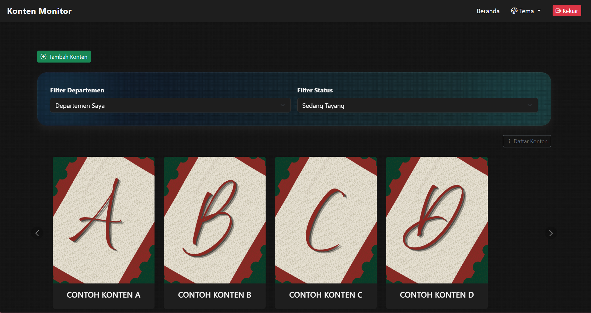
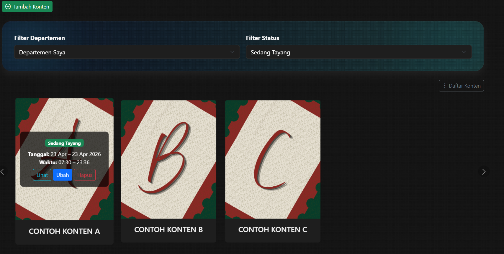
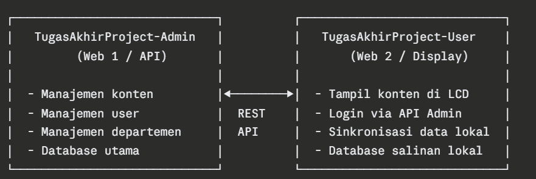

# UMY Digital Signage Management System

> Tugas Akhir S1 Teknik Informatika — Universitas Muhammadiyah Yogyakarta


UMY Digital Signage Management System hadir sebagai solusi terpusat untuk mengelola, menjadwalkan, dan menayangkan konten informasi pada layar LCD di seluruh lingkungan **Universitas Muhammadiyah Yogyakarta**. Dengan sistem hak akses hierarkis dan fitur kolaborasi konten lintas **departemen**, setiap **unit kerja**, **fakultas**, dan **program studi** kini dapat menyampaikan informasi secara tepat sasaran tanpa tumpang tindih dan tanpa kerumitan.

> [!NOTE]
> Repositori ini adalah sisi **Admin** (web manajemen konten). Untuk aplikasi display layar LCD, lihat repositori [TugasAkhirProject-User](https://github.com/raraend/TugasAkhirProject-USER.git).


---


## Daftar Isi

- [Screenshot](#screenshot)
- [Fitur](#fitur)
- [Tech Stack](#tech-stack)
- [Arsitektur Sistem](#arsitektur-sistem)
- [Struktur Folder](#struktur-folder)
- [Kontak](#kontak)

---

## Screenshot


- Tampilan manajemen konten Admin




- Tampilan Opsi Manajemen Konten


---
## Fitur

- Penjadwalan konten berbasis tanggal, jam, dan hari tayang
- Upload konten berupa gambar dan video untuk ditayangkan di layar LCD
- Role-based access control (Superadmin & Admin)
- Hierarki departemen bertingkat (Universitas → Fakultas → Prodi / Unit Kerja)
- Filter konten berdasarkan departemen dan status tayang
- Visibilitas konten lintas departemen (parent-child)
- Manajemen user dan departemen oleh Superadmin
- REST API untuk dikonsumsi oleh aplikasi display ([TugasAkhirProject-User](https://github.com/raraend/TugasAkhirProject-USER.git))

---


## Tech Stack

**Frontend**


**Backend**


**Database**


---
## Arsitektur Sistem

Sistem ini menyediakan REST API yang dapat digunakan oleh aplikasi display ([TugasAkhirProject-User](https://github.com/username/TugasAkhirProject-User)) untuk mengambil dan menampilkan konten terjadwal di layar LCD.

**Base URL**
http://localhost:8000/api


**Alur autentikasi:**

1. User membuka Web 2 (Display) dan mengisi form login
2. Web 2 memvalidasi input lokal, lalu meneruskan ke `POST /api/login` Web 1
3. Web 1 memverifikasi kredensial dan mengembalikan **Sanctum Bearer Token**
4. Web 2 menyimpan token di session server-side (tidak terekspos ke browser)
5. Token digunakan sebagai tanda sesi aktif selama user menggunakan aplikasi

**Alur sinkronisasi konten:**

1. Web 2 memanggil `SyncService` untuk menarik data konten terbaru dari Web 1
2. Data disimpan ke database lokal Web 2
3. File media diakses via endpoint `/sync-file/{uuid}` di Web 1
4. Web 2 menyajikan konten ke layar LCD dari database lokalnya sendiri

---

## Struktur Folder

```
TugasAkhirAdmin/
├── App/
│   ├── Http/
        ├── Controller/ 
            ├── ApiController/ 
            ├── Controller/ 
            ├── Models/
├── Database/
    ├── Migration/
├── public/
├── resource/
    ├── css/
    ├── js/
    ├── views/
├── routes/
    ├── api.php/
    ├── web.php/
├── .env
└── README.md
```

---

## Kontak

Rara Eva Maharani — raarevamaharani@gmail.com
>Repositori ini dibuat sebagai bagian dari penyelesaian Tugas Akhir S1 Teknik Informatika UMY — 2025.
